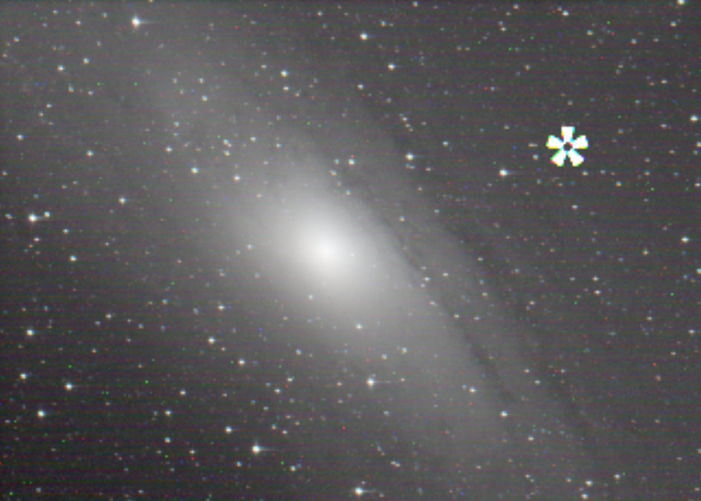

# Anomaly dection using Milvus, Presto and Kafka on a Lakehouse

Beautiful pictures often catch our eye. Take the night sky, for example: under the moonlight, it sparks wonder and romance. But not always... because behind its peaceful look, it could be hiding unseen dangers. What if you spot something unusual, potentially heading on a collision course with your area? That’s definitely not romantic and, fortunately, not the normal case. That’s why we call it an "anomaly."

## A big family of use cases

There are numerous examples where anomaly detection is critical, not only for a company's success but also for the well-being of society. Some key areas include:

- Quality control in the automotive industry
- Detecting fabric defects in retail
- Surface deterioration in civil engineering
- Defect detection in electronics
- Assisted disease diagnosis and alike in life sciences
- ...and many more, such as in agriculture, surveillance, and beyond.

For this demo, the use case we will present is of monumental importance. Indeed, the threat it addesses could compromise the very existence of humanity: the detection of asteroids or near-Earth objects with potentially devastating consequences if a collision might occur.

Don't think about science fiction now, this is no kidding at all. In fact,  significant resources have been, and continue to be, invested in identifying potentially hazardous objects in space. Projects like the [NEO Surveyor](https://science.nasa.gov/mission/neo-surveyor/), the [Space Mision DART](https://science.nasa.gov/mission/dart/) , and the [Flyeye project](https://www.esa.int/ESA_Multimedia/Images/2016/10/Flyeye_telescope) are dedicated to detecting these threats and protecting the Eartht from potential risks.

<!-- Row 0 -->

<table style="float:left;  border-spacing: 10px; border-collapse: separate; table-layout: fixed">
    <td style="padding: 15px; text-align:left; vertical-align: text-top; background-color:#F7F7F7; width: 300px; height: 250px;">
        

<!-- Title -->
NEO Surveyor Project
        

        

<!-- Description -->
Near-Earth Object (NEO) Surveyor is the first space telescope specifically designed to hunt asteroids and comets that may be potential hazards to Earth.
        

        

<!-- Duration -->
        

        

<!-- URL -->

        

    </td>
    <td style="padding: 15px; text-align:left; vertical-align: text-top; background-color:#F7F7F7; width: 300px; height:250px">
        

<!-- Title -->
Space Mission DART

        

<!-- Abstract -->
DART (Double Asteroid Redirection Test) was the first-ever mission dedicated to investigating and demonstrating one method of asteroid deflection by changing an asteroid’s motion in space through kinetic impact.
        

        

        
  
        

<!-- URL -->

        

    </td>
    <td style="padding: 15px; text-align:left; vertical-align: text-top; background-color:#F7F7F7; width: 300px; height: 250px;">
        

<!-- Title -->
Flyeye Observatory
        

        

<!-- Description -->
As part of the global effort to spot risky celestial objects such as asteroids and comets, ESA is developing a network of automated telescopes for nightly sky surveys. The Flyeye-1 telescope is the first in a future network that would scan the entire sky and automatically identify possible new near-Earth objects (NEOs) for follow up and later checking by human astronomers.
        

        

<!-- Duration -->
        

        

<!-- URL -->

        

    </td>

</table>

  

## Objectives

The motivation of the demo is to illustrate how a group of technologies can be easily integrated to extract valuable insights from the combination of graphical content and its metadata (with indepence of the use case or the industry area). It is not intended to represent an actual implementation of near-Earth object detection. No, astronomers do not operate exactly in this way. However, this is not an obstacle to learn how to how to effectively combine multiple technological components to achieve useful outcomes.

Consider a project that requires:

- Unstructured mass storage in a Lakehouse
- Extraction and management of content metadata
- Event generation and data transport
- Embedding generation and similarity search using a vector database

Milvus, Kafka, Presto, Iceberg, Python are good technology candidates to address the requirements mentioned above. They are integrated and demonstrated in the following sections.  The demo is hosted in an environment created by IBMers called [watsonx.data Lab](https://ibm.github.io/watsonx-data-lab/) aimed at educating other IBMers, Business Partners, and anyone with access to the [IBM TechZone](https://ibm.github.io/watsonx-data-lab/).

 This environment extensively leverages the commercial product [watsonx.data](https://www.ibm.com/products/watsonx-data) which combines many technologies typically present in projects dedicated to analytics and artifical intelligence. Take a look at the [watsonx.data Solution Brief](https://www.ibm.com/downloads/cas/4Z1YXEBO) for more details on this product.

## The story

Professional and amateur astronomers point their instruments to the sky and take pictures, either for science, or work or fun or all together.

If they encounter an unidentified object, that is considered an **anomaly**. Then, they continue to observe and calculate the trajectory of the offending object to determine whether it poses any concern or not. These anomalies can range from insignificant issues like space debris, camera malfunctions or atmospheric interference to potentially significant discoveries such as previously unnoticed asteroids or comets. One example of a surveillance system used for this purpose is [Scout: NEOCP Hazard Assessment](https://cneos.jpl.nasa.gov/scout/intro.html).

  

In order to assess the risks of an object, astronomers often compare their observations (i.e: their own sky images) with established scientific databases that catalog all known celestial objects. Examples of these databases include [GAIA](https://www.cosmos.esa.int/web/gaia/), the [Horizons System](https://ssd.jpl.nasa.gov/horizons/) and the [Minor Planet Center](http://www.minorplanetcenter.net/about).  These systems house billions of entries and petabytes of data. Indeed, the universe is vast. 

### 1. Data Initialization

The demo illustrates how to create a **private image repository in a Data Lakehouse**, which is probably what a company would do with its confidential material. We will use a bunch of pictures and store them in watsonx.data in two parts: the **graphical embeddings in a vector database** (Milvus) and the **metadata in object store** using Presto and Iceberg. The process is depicted in the following picture. Note how we split the raw graphical information and the associated metadata.

In short, we can say that the embeddings are vectorized representations of the image, which we will use for comparing pictures and identifying strange things. If you are interested in the details:

- first of all, the picture is flattened. That is: a 2D dimensional array is converted into a sequence of bits (or pixels,to be more precise) which is already a vector.
- then, the vector is normalized by dividing it by the L2 norm (Euclidean norm) and so we have a unit vector.
- finally, we have an embedding which is inserted into a collection in Milvus

The metadata is tabular information contains additional details about the picture (date, location, weather, exposure, telecope...). The embeddings (vectors) is what some people would call "unstructured" information and the metadata  have a traditional structure can be stored in our well-known relational tables.

### 2. Content generation: graphics and metadata

Assume that we have an amateur telescope pointing to the sky. The target for tonight is the [Andromeda Galaxy, aka. M31](https://en.wikipedia.org/wiki/Andromeda_Galaxy). At the naked eye, this object is six times bigger than the moon but it is really faint. That is: if you have a dark sky and if your eyes work well you may guess a faint, grey ellipse. Simple binoculars or a **wide field telescope** will give you a quite different perspective. Something like this:

To get pictures, we attach a **deep space camera** to the telescope and connect the camera to small computer that acts as an **event generator**. Every time a picture is captured, the event lands onto our demo system bringing the graphic and metadata content. This looks like something like this:

Obviuosly, there are many cables that I am not showing in the picture and a few more components necessary to get a decent picture. Anyway, if you are curious take a look at some of them:

Astronomical instruments, even for amateurs, do not usually generate pictures in a format that the common public likes (it is the same with industrial sensors, right?). A popular picture format in astronomy is called [FITS](https://en.wikipedia.org/wiki/FITS) which is optimized for the processing work that is needed in astronomy. For this demo, the good thing about this format is that it contains plenty of metadata embedded in the picture file. Look at the right part of the following picture:

In real life, the white box you saw in a previous picture (labeled as "Event Generator") is a normal Raspberry Pi containing astronomical software and, additionally, a **Kafka Producer** which sends the pictures to a Kafka Broker. Actually, the task of the white box has been emulated with a python snippet for this demo. Otherwise, an astronomical camera and a guiding system would be necessary to run the code... not really practical (again, the same issue would ocurr with industrial sensors: too cumbersome to be carried on). Anyway, the demo system does have a real Kafka broker, which is a very interseting starting point.

### 3. Content transport, storage and similarity search

As pictures are not be huge, that makes it possible for Kafka to be the means of transport of the full content. So, we get the pictures generated by the telescope as **Kafka events**, they are sent to the broker by a producer client and will received in the server by a consumer.

At this stage, two actions can be taken:

- **Similarity Search**: Immediately check if the received image matches any existing image in the private repository. This is done by generating an embedding from the event and comparing it with those in the pre-existing repository. This has been populated when we set up the demo as indicated in the previous section.
- **Event Archiving**: Store the event in watsonx.data. Beyond anomaly detection, there are other potential uses for the captured data, making it valuable to archive the telescope's observations in a persistent storage and not leaving it in Kafka. However, note that the archiving is optional. The event can be disposed after the similarity check.

If you are interested in the search method performed by Milvus, we can say that we use Euclidean distance metric (L2) in this demo. This means that the search will calculate the L2 distance (or squared Euclidean distance) between the query vector and the stored vectors in the collection. In fact, that matches perfectly the way we generated the embeddings during the population of the private repository. To simplify things: if a search yields a zero-distance between two embeddings, it means that the corresponding pictures are identical (or almost identical). It is up to us to decide the distance threshold to consider a picture as "normal" or "anomaly".

For example, if you see this, you will think that is not normal...won't you?

  

Indeed, you will see in the demo that this picture has a score (distance) of **more than 150** compared with the repository of the normal pictures of M31.

Metadata is essential for conducting more efficient searches, as it allows for more targeted and sensible queries instead of relying on brute-force scanning of all images. By using metadata, it is possible to exclude images that are unsuitable for comparison due to various conditions (a different zone in the sky, uncompatible exposures, etc.), thereby improving the accuracy and speed of the search process. For the demo, the metadata has been redundantly added to the Milvus collection containing the embeddings in order to make it easier the experimentation.

Note that this scenario can easily be generalized to other use cases. For example, consider a drone inspecting a bridge for **structural defects** or a camera identifying **imperfections in textile fabrics**, among many other potential applications.

## How to run the demo

Two steps are necessary:

- Preparation: follow the instructions in the [Setup Script](demo/setup_demo.md)
- Live demonstration: run the cells in the notebook [`run_demo.ipynb`](demo/run_demo.ipynb)

I hope this demo was both informative and enjoyable for you. The goal was to showcase the capabilities in a clear and engaging way, so that you can apply them in your area of expertise. I’d be delighted to hear any thoughts or suggestions you might have. 