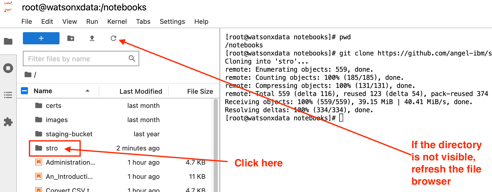

# Welcome

This Demo Script can be found here:
<https://github.com/angel-ibm/stro>

and it is based on the technologies described on this lab:
<https://ibm.github.io/watsonx-data-lab/>

## Prerequisites

You need to have access to the IBM TechZone <https://techzone.ibm.com> and need to provision this demo environment: <https://ibm.github.io/watsonx-data-lab/wxd-reference-techzone/>.

The important sections are:

- Jupyter:
<https://ibm.github.io/watsonx-data-lab/wxd-jupyter/>

- Kafka:
<https://ibm.github.io/watsonx-data-lab/wxd-kafka/>

- Milvus:
<https://ibm.github.io/watsonx-data-lab/wxd-milvus/>

Needless to say, the section dedicated to the watsonx.data UI is also essential to exercise the demo. It is recommended to review it and verify that it works as expected <https://ibm.github.io/watsonx-data-lab/wxd-intro-watsonui/>

## Environment Setup

### 1. Jupyter

- Get Jupyter up and running following the instructions of the lab. See:  
  <https://ibm.github.io/watsonx-data-lab/wxd-jupyter/>
  
- Verify that Jupyter works well with watsonx.data running the notebook `Python Example.ipynb`

- Change to the `Jupyter Lab` GUI, not the Jupyter Notebook:
  

- Open a terminal in Jupyter Lab

- Download the demo code. In other words, clone the demo repository by typing on the prompt: `git clone https://github.com/angel-ibm/stro.git`

- Go into the demo directory (`stro`) that has been automatically created with the clone command

- Finally, go into the demo directory

### 2. Milvus

- Ensure to complete the setup of Milvus in the lab image. See:
<https://ibm.github.io/watsonx-data-lab/wxd-milvus/>

- Verify that Milvus works well by running the notebook `Milvus Example.ipynb`

### 3. Kafka

- Prepare Kafka follwing the instructions of the lab. See:
   <https://ibm.github.io/watsonx-data-lab/wxd-kafka/>
  
- Verify Kafka  by running the notebook `Kafka.ipynb`

## Demo Setup

- Open the Jupyter Notebook interface
- Switch to Jupyter Lab
- Open a terminal
- ensure that you are in /notebooks
- Clone the repository: `git clone https://github.com/angel-ibm/stro.git`
- Start the notebook `full_demo.ipynb`
