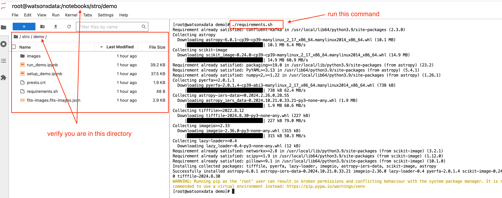
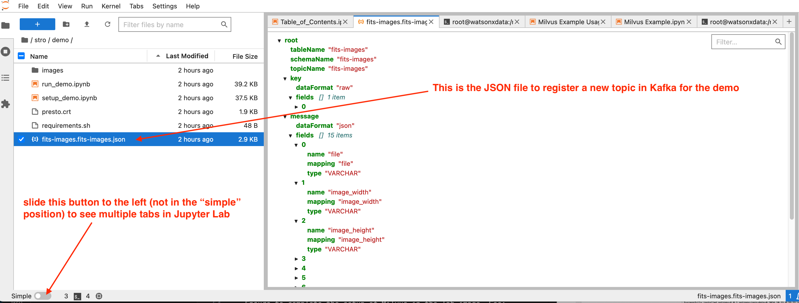
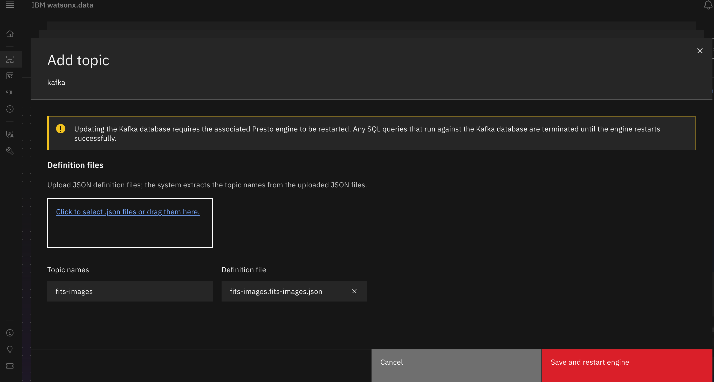

# Demo Setup

We will provision and prepare a watsonx.data system to tun the demo. The full environment is based on the technologies described on this lab:
<https://ibm.github.io/watsonx-data-lab/>

## Prerequisites

You need to have access to the IBM TechZone <https://techzone.ibm.com> and need to provision this demo environment: <https://ibm.github.io/watsonx-data-lab/wxd-reference-techzone/>.

While the system is provisioning, just review the important sections to get a first feeling of what is going to happen next:

- Jupyter:
<https://ibm.github.io/watsonx-data-lab/wxd-jupyter/>

- Kafka:
<https://ibm.github.io/watsonx-data-lab/wxd-kafka/>

- Milvus:
<https://ibm.github.io/watsonx-data-lab/wxd-milvus/>

Needless to say, the section dedicated to the watsonx.data UI is  essential to exercise the demo. After the system has been provisioned, it is recommended to review and verify that the GUI works as expected before anything else: <https://ibm.github.io/watsonx-data-lab/wxd-intro-watsonui/>

## Environment Setup

### 1. Jupyter

- Get Jupyter up and running following the instructions of the lab. See:  
  <https://ibm.github.io/watsonx-data-lab/wxd-jupyter/>
  
- Verify that Jupyter works well with watsonx.data running the notebook `Python Example.ipynb`

- Change to the `Jupyter Lab` GUI, not the Jupyter Notebook:
  

- Open a terminal in Jupyter Lab

- Download the demo code. In other words, clone the demo repository by typing on the prompt: `git clone https://github.com/angel-ibm/stro.git`

- Go into the demo directory (`stro`) that has been automatically created with the clone command

- Finally, go into the demo directory

### 2. Python requirements

Run the requirements.sh shell script that installs the additional python packages necessary for the demo

### 3. Milvus

- Ensure to complete the setup of Milvus in the lab image. See:
<https://ibm.github.io/watsonx-data-lab/wxd-milvus/>

- Verify that Milvus works well by running the notebook `Milvus Example.ipynb`. It is not necessary to try the remote connection section of the notebook because we will execute everything locally on the environment we have just provisioned.

### 4. Kafka

- Prepare the Kafka server by following the instructions of the lab. See: <https://ibm.github.io/watsonx-data-lab/wxd-kafka/>. Run this up to the end. The notebook `Kafka.ipynb` is the best way to perform the initial tasks without typing.
  
This preparation is very important, please take your time to run and understand the contents of this section.

Pay special attention at the section where a new topic is registered in Kafka with a customized json file. Learn how to do it because you will need to add a special one for the demo.

- Once you have completed the Kafka section, add a new topic following exactly the same instructions but using this file:

Then, you will see something like this:

Just press the red button and congratulations!! You finished the demo setup. You may no run the demo using the notebook [run_demo.ipynb](run_demo.ipynb) locally on the provisioned system.